# Beyond the Chatbox

Autoregression, Context, and MCP

<div class="pt-12">
  <span @click="$slidev.nav.next" class="px-2 py-1 rounded cursor-pointer" hover="bg-white bg-opacity-10">
    A Programmer's Guide to the LLM Stack <carbon:arrow-right class="inline"/>
  </span>
</div>

<!--
Welcome everyone. Today we're going deep into how LLMs actually work from a developer's perspective.
This isn't about prompt engineering tricks - it's about understanding the underlying mechanisms.
We'll build up from tokens to the latest MCP protocol that's changing how we integrate tools.
-->

---
layout: default
---

# Agenda

- **The Atom**: Tokens & The "Strawberry" Problem
- **The Resource**: Context Windows & Management
- **The API Evolution**: From Completion to Chat
- **The Hands**: Tool Use (Function Calling & Code Execution)
- **The Protocol**: MCP (Model Context Protocol)
- **The Workflow**: Windsurf's Rules, Skills, and Agent Orchestration

<!--
We'll start from the fundamentals - what tokens are and why they matter.
Then we'll see how context windows work and their limitations.
The middle section covers how we interact with models through APIs and tools.
Finally, we'll explore MCP and see it in action with Windsurf, our team's IDE.
This progression mirrors how you'd actually build an LLM application from scratch.
-->

---
layout: two-cols
---

# Tokens: The "Atom" of LLMs

- LLMs don't "see" text as humans do
- **Byte Pair Encoding (BPE)** splits text into subword units
- Each token → unique integer ID
- Model operates purely on token IDs


### The "Strawberry" Case Study

```text
"How many 'r's in 'strawberry'?"

Tokenization:
"strawberry" → ["st", "raw", "berry"]
             → [302, 1618, 19772]  (example IDs)
```

**The Problem**: The model never "sees" individual letters!

Real example: [OpenAI tokenizer](https://platform.openai.com/tokenizer)


::right::

<Transform :scale="0.7">

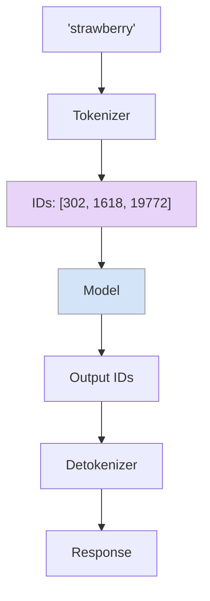

</Transform>


### Developer Takeaway

- Token boundaries affect string operations
- Impacts JSON parsing, code generation
- Why some prompts need repetition


<!--
This is crucial to understand. When GPT-4 couldn't count r's in strawberry, it wasn't being stupid.
The tokenizer had already broken it into chunks, and the model only saw those chunk IDs.
This has real implications: JSON parsing can fail at token boundaries, especially with nested structures.
Code generation sometimes repeats itself because token probabilities favor common patterns.
Understanding tokenization helps debug weird LLM behaviors.
-->

---
layout: default
---

# Autoregression: The Completion Loop

### The Black Box View

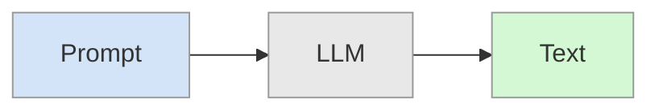

As a developer: **Prompt → LLM → Output**

---
layout: two-cols
---

# Inside: Token-by-Token Generation

For **each token**:
1. Look at all previous tokens
2. Calculate: $P(t_{next} | t_1...t_n)$
3. Pick next token (**temperature**, topK, topP controls randomness)
4. Append and repeat

**Stops when**:
- End token generated (`<|end|>`)
- Max token limit reached

::right::

<Transform :scale="1">

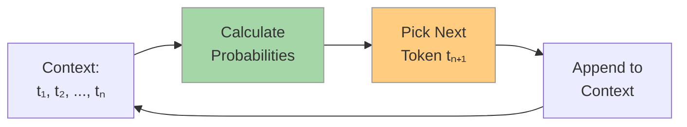

</Transform>


**Key**: Each token depends on ALL previous tokens. Once generated, it can't be changed.

**Impact**: Early mistakes cascade into **hallucinations** - if the model starts with wrong info, it continues building on that error.


<!--
Combined view: start with simple black box, then reveal autoregression.
Temperature mentioned inline where it matters (step 3).

Autoregression and hallucinations:
The autoregressive nature is a key source of hallucinations. Once the model generates a wrong token,
that token becomes part of the context for all subsequent predictions. This creates a cascade effect:
- If it starts saying "The capital of Australia is Sydney" (wrong - it's Canberra)
- It will continue with "Sydney, located on the east coast..." building on the false premise
- It can't "backtrack" and correct itself mid-generation

This is different from "lost in the middle" (next slide):
- Lost in middle: model can't SEE the correct information (attention issue)
- Autoregression cascade: model is MISLED by its own wrong output (generation issue)

Both contribute to hallucinations but through different mechanisms.

This also explains why "chain of thought" and "thinking before answering" help reduce hallucinations:
better early tokens lead to better trajectories. If the model reasons through "capital of Australia"
before committing to an answer, it's more likely to get Canberra right.

This leads naturally to context window discussion - "all previous tokens" means context grows!
-->

---
layout: two-cols
---

# Multi-Turn Conversations

### Chat Completion API Structure

```typescript {*}{fontSize:'0.75rem',lineHeight:'1.3'}
POST /v1/chat/completions
{
  "model": "gpt-4",
  "messages": [
    {"role": "system", "content": "..."},
    {"role": "user", "content": "..."},
    {"role": "assistant", "content": "..."}
  ]
}
```

### The Illusion of Memory

LLMs are **stateless** - they don't remember previous conversations!

Each API call sends the **entire conversation history** as input.

**Key Insight**: The model "remembers" because YOUR APP replays the entire conversation each time!

::right::

<Transform :scale="0.75">

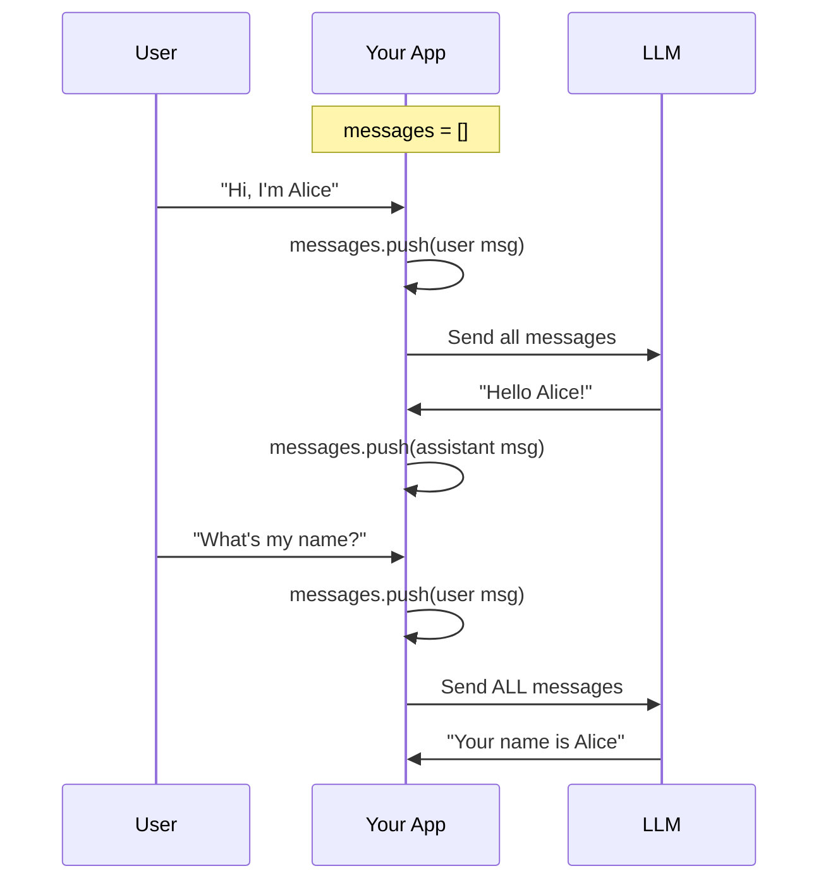

</Transform>

<!--
This is a critical mental model shift for developers.
When you chat with ChatGPT and it "remembers" your name, it's not storing that in a database.
The app is sending every previous message in EVERY API call.
This is why conversations feel stateful even though the model is stateless.
The app manages state, the model just processes the full context each time.
This directly explains why context windows matter - longer conversations = more tokens.
-->

---
layout: two-cols
---

# Multi-Turn: What Actually Happens

### Each API Call

```typescript {*}{fontSize:'0.65rem',lineHeight:'1.2'}
// Turn 1
messages = [
  {role: "system", content: "You are helpful"},
  {role: "user", content: "Hi, I'm Alice"}
]
// → LLM returns: "Hello Alice!"

// Turn 2 - FULL history sent again
messages = [
  {role: "system", content: "You are helpful"},
  {role: "user", content: "Hi, I'm Alice"},
  {role: "assistant", content: "Hello Alice!"},
  {role: "user", content: "What's my name?"}
]
// → LLM returns: "Your name is Alice"
```

::right::

### The Growing Cost

Each turn sends MORE tokens than before:

```text
Turn 1:  ~50 tokens  →  Turn 10: ~500 tokens
Turn 20: ~1,500 tokens  →  Turn 50: ~5,000 tokens
```

**Implications**: Context limits, re-processing cost, need summarization/pruning strategies.


<div class="flex flex-col items-center">
  
</div>

<!--
This slide makes the cost model concrete.
Each turn, you're sending MORE tokens than before - the entire history plus the new message.
By turn 20, a simple conversation might be 1500+ tokens per request.
This is why production apps need context management strategies.
Summarize older messages, prune irrelevant turns, or use sliding windows.
Otherwise, you'll hit context limits AND rack up huge API bills.
This transitions naturally to context windows - which impose the hard limit.
-->

---
layout: center
---

# The "Lost in the Middle" Phenomenon

<div class="flex gap-8 items-center">
  <div class="flex-1">
    
  </div>
  <div class="flex-1">
    
  </div>
</div>

<div class="mt-4 text-center">

Models recall best from **start** or **end** of context.

**Impact**: If critical facts are buried in the middle, the model may "forget" them and **hallucinate** instead.

</div>

---

# Key Principle: Quality In, Quality Out

**LLM output quality largely depends on input quality.**

- Well-structured context → Accurate responses
- Messy or incomplete context → Hallucinations and errors
- Strategic placement of information → Better results


<!--
This is a hard constraint that shapes everything we do with LLMs.
200k sounds huge, but in practice it fills up fast with conversation history and documents.
The "lost in the middle" phenomenon is research-backed: models are attention-based,
and they naturally weight the start and end more heavily.

This directly contributes to hallucinations: if you put the source of truth in the middle of a long context,
the model might not "see" it and will generate plausible-sounding but incorrect information instead.
This is why RAG systems that dump 50 documents into the middle of a prompt often fail.

The "Quality In, Quality Out" principle is fundamental:
- You can't get good outputs from bad inputs
- Context quality includes: accuracy, relevance, structure, and placement
- Many production issues stem from poor context management, not model limitations
- Think of context as your "working memory" - keep it clean, organized, and focused

Best practices:
- Put critical facts at the beginning (system prompt) or end (recent context)
- Use prompt caching for frequently-used context at the start
- Summarize or filter middle content aggressively
- Continuously curate and prune context as conversations grow
Strategic context management is more important than having a large window.
-->

---
layout: default
---

# Prompt Engineering: Core Techniques

Why these work: **Autoregression generates based on input patterns** - better prompts = better output trajectories.

<div class="text-sm">

| Technique | Why It Works | Example |
|-----------|--------------|---------|
| **Role Assignment** | Activates domain-specific training patterns | `"You are a senior engineer..."` |
| **Few-Shot Prompting** | Demonstrates expected format and reasoning | `"happy→positive" "terrible→negative" "awesome→?"` |
| **Chain of Thought** | Forces step-by-step reasoning, reduces errors | `"Let's think step by step..."` |
| **Give an "Out"** | Reduces hallucination by allowing uncertainty | `"If unsure, say 'I don't know'"` |
| **Output Format** | Constrains generation to valid structures | `"Respond in JSON: {name, email, age}"` |

</div>


<!--
These techniques all leverage how autoregression works.

Role Assignment: When you say "You are a senior Python developer", you're essentially
conditioning the probability distribution toward code patterns seen in expert contexts.
The model activates different "knowledge clusters" based on the persona.

Few-Shot: By showing examples, you're giving the model concrete patterns to follow.
It will generate tokens that continue the pattern you've established.
Works well because transformers are excellent at pattern matching.

Chain of Thought: Remember, early tokens influence later ones. By forcing the model
to "think step by step", you ensure it generates reasoning tokens BEFORE the answer.
This creates a better trajectory and catches errors early.

Output Format: Constraining the output format reduces the solution space.
Instead of free-form text, the model focuses on valid JSON/XML/etc.
Combined with structured output mode (JSON mode), this is very powerful.

These techniques stack: Role + Few-Shot + CoT + Format = production-grade prompts.
-->

---
layout: default
---

# Context Engineering

Managing the finite context window effectively.

<div class="grid grid-cols-3 gap-6 mt-6">

<div class="p-4 bg-green-50 rounded-lg">

### Select

**What to include?**

- **RAG**: Retrieve relevant docs dynamically
- **Semantic search**: Find related code/content
- **Recency bias**: Prioritize recent context

*"Fetch only what's needed, when it's needed"*

</div>

<div class="p-4 bg-blue-50 rounded-lg">

### Compress

**How to fit more?**

- **Summarization**: Condense old conversations
- **Sliding windows**: Drop oldest messages
- **Prompt caching**: Reuse static prefixes

*"Same information, fewer tokens"*

</div>

<div class="p-4 bg-purple-50 rounded-lg">

### Multi-Agent

**Divide and conquer**

- **Specialized agents**: Each with focused context
- **Orchestrator**: Routes tasks to experts
- **Shared memory**: External state store

*"Multiple small contexts > one overloaded context"*

</div>

</div>

<!--
Context engineering is the art of managing the finite context window.

Select: Don't dump everything into the prompt. Use RAG to dynamically retrieve
only the documents relevant to the current query. Semantic search helps find
related code snippets. Recency bias means prioritizing recent messages.

Compress: When context grows, compress it. Summarize older conversation turns
into a paragraph. Use sliding windows to drop the oldest messages. Prompt caching
(offered by Anthropic, OpenAI) lets you reuse the static prefix without re-processing.

Multi-Agent: Instead of one agent with a massive context, use multiple specialized
agents. A code agent knows about code, a docs agent knows about documentation.
An orchestrator routes tasks. External memory (databases, vector stores) provides
shared state. This is how production systems like Devin, Windsurf, and Cursor work.

These three strategies stack: Select the right content, Compress it efficiently,
and Distribute across multiple agents when a single context isn't enough.
-->

---
layout: center
class: text-center
---

# Part 3: Extending Capability

## Tool Use (Function Calling)

Giving the Model "Hands"

<!--
Now we get to the exciting part: making LLMs do things, not just say things.
Tool use is what transforms a chatbot into an agent that can search the web, run code, or query databases.
This is foundational for Windsurf and any serious LLM application.
-->

---
layout: two-cols
---

# Tool Use: The Mechanism

### How It Actually Works

1. You define tools (functions) in the API call
2. Model generates **structured JSON intent** ← *Structured Output!*
3. Your client executes the tool
4. Result feeds back into model's context
5. Model continues reasoning

**Key Insight**: Tool calling is structured output in action - the model outputs valid JSON that your code can parse and execute!


::right::

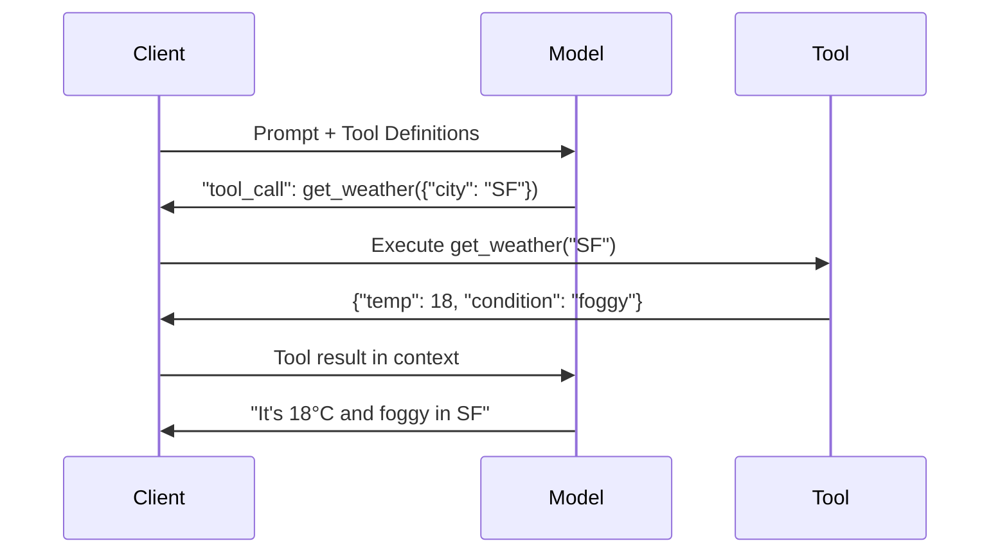


<!--
This loop is the heart of agentic systems. The model is the brain, tools are the hands.
The model can't actually DO anything - it just decides WHAT to do.
Your application is responsible for safe execution, error handling, and security.
This separation is actually a feature: you control what the model can access.
The loop continues until the model decides it has enough information to answer.
-->

---
layout: default
---

# Tool Use: Code Example

### Defining Tools

```typescript {*}{fontSize:'0.7rem',lineHeight:'1.2'}
const tools = [
  {
    type: "function",
    function: {
      name: "web_search",
      description: "Search the web for current information",
      parameters: {
        type: "object",
        properties: { query: { type: "string", description: "Search query" } },
        required: ["query"]
      }
    }
  },
  {
    type: "function",
    function: {
      name: "execute_javascript",
      description: "Execute Javascript code in a sandboxed environment",
      parameters: {
        type: "object",
        properties: { code: { type: "string", description: "Javascript code to execute" } },
        required: ["code"]
      }
    }
  }
];
```

<!--
Tool definitions follow JSON Schema format. Be specific in descriptions - the model uses them to decide when to call.
Notice we have two very different tools: one for external data, one for computation.
The model will choose based on the user's query. "What's the weather?" triggers web_search.
"Calculate 123456 * 789" might trigger execute_python if the model knows it struggles with large multiplication.
-->

---
layout: default
---

# Tool Use: Execution Loop

```typescript {*}{fontSize:'0.65rem',lineHeight:'1.2'}
const messages = [
  { role: "system", content: "You are a helpful assistant with access to web search and code execution." },
  { role: "user", content: "What's the current price of GOOG? Then calculate 10% of that." }
];

let response = await openai.chat.completions.create({ model: "gpt-4", messages, tools });

// Model decides to call web_search
if (response.choices[0].message.tool_calls) {
  const toolCall = response.choices[0].message.tool_calls[0];
  console.log(`Calling: ${toolCall.function.name}(${toolCall.function.arguments})`);
  // >>> Calling: web_search({"query": "current GOOG price"})
}

// Execute the tool
const searchResult = await executeWebSearch(JSON.parse(toolCall.function.arguments).query);
// Result: "GOOG is currently trading at $333"

// Feed result back to model
messages.push(response.choices[0].message);
messages.push({ role: "tool", tool_call_id: toolCall.id, content: JSON.stringify(searchResult) });
```

<!--
This is the actual implementation pattern. Line by line:
1-5: We start with a user request that requires external data AND computation
7-11: First API call with tool definitions
13-18: Model returns a tool_call JSON, not a text response
20-28: We execute the tool and append the result to the conversation
Then you'd make another API call, and the model might call execute_python next.
This multi-turn loop is how complex tasks get accomplished. Windsurf does this internally.
-->

---
layout: default
---

# Tool Use: Code Execution Example

### Why Code Execution?

- LLMs are **bad at math**: `123456 * 789012 = ?` → unreliable
- LLMs can't generate **real-time visualizations**
- But LLMs are **great at writing code** to solve these problems!


### The Pattern

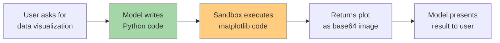


<!--
This is a killer feature that makes LLMs actually useful for technical tasks.
Without code execution, asking "plot a sine wave" would just get you a text description.
WITH code execution, the model writes matplotlib code, runs it, and shows you the actual plot.
The same applies to complex math: the model knows to delegate to Python for precision.
This is how tools like Claude Artifacts and ChatGPT Code Interpreter work.
-->

---
layout: center
class: text-center
---

# Part 4: The Protocol Era

## MCP (Model Context Protocol)

The "USB-C" for AI

<!--
Now we get to the cutting edge. MCP is Anthropic's answer to a huge problem in the LLM ecosystem.
Every tool, every integration has been a custom implementation. MCP standardizes this.
Think of it as REST APIs for LLM tool integration.
-->

---
layout: two-cols
---

# MCP: The Problem

### Before MCP

Every integration is custom:
- **Figma** → custom API wrapper
- **GitHub** → custom API wrapper
- **Postgres** → custom API wrapper

And this is **per client** (Claude Desktop, Cursor, ChatGPT, etc.)

### The Integration Explosion

```text
N Tools × M Clients = N×M integrations

10 tools × 5 clients = 50 custom integrations!
```

::right::

<Transform :scale="0.6">

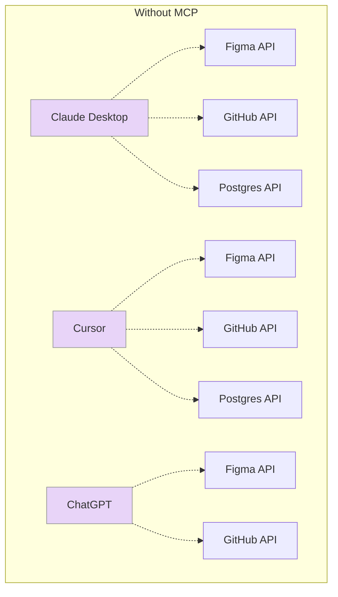

</Transform>

Every arrow is custom code!


<!--
This is the pain point MCP solves. Before MCP, if you built a Figma integration for Claude,
that code wouldn't work for Cursor or any other LLM client.
Tool builders had to write separate implementations for each LLM platform.
Client builders had to write custom integrations for each tool they wanted to support.
This doesn't scale. It's like having different USB connectors for every device.
MCP provides the standard so everyone speaks the same language.
-->

---
layout: two-cols
---

# MCP: The Solution

### Architecture

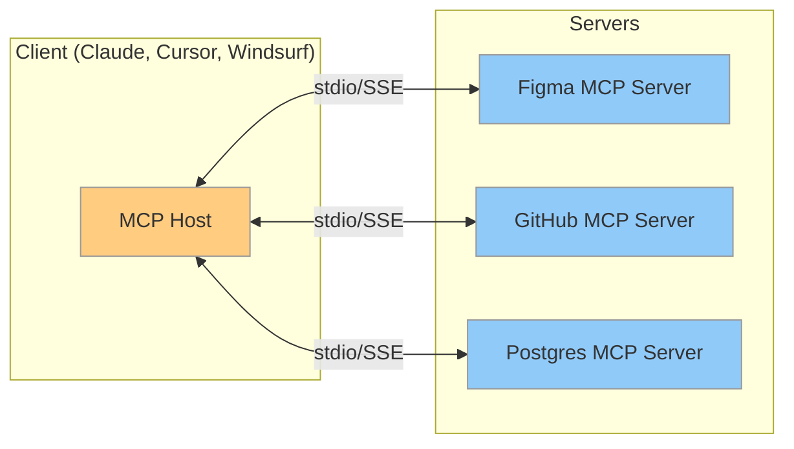

::right::

### Key Components

- **Client**: LLM app (Claude, Cursor, Windsurf) with embedded MCP Host
- **Server**: Provides tools/resources/prompts via standard MCP interface
- **Transport**: stdio (local) or SSE (remote)

<div class="mt-6 p-3 bg-amber-50 border-l-4 border-amber-400 rounded">

**Key Shift**: Tool definitions move from **client-side** to **server-side**.

The server declares its own capabilities — clients just discover and use them!

</div>

<!--
This is the architecture that makes everything work. Three layers:
1. Client: Your LLM app - it just speaks MCP, doesn't care about underlying tools
2. Host: The middleware that manages connections - often built into the client
3. Servers: Individual tools that implement the MCP spec

The KEY insight: Before MCP, each client had to define tool schemas for each integration.
With MCP, the SERVER defines its own tools. The client just asks "what can you do?"
and the server responds with its capabilities. This inverts the responsibility.

Communication happens over stdio or Server-Sent Events - both simple, well-understood protocols.
Once a tool implements MCP, ANY client can use it. Once a client implements MCP, it can use ANY tool.
This is the network effect that will accelerate LLM tool development.
-->

---
layout: two-cols
---

# MCP: Real-World Examples

### GitHub MCP Server

```json {*}{fontSize:'0.65rem',lineHeight:'1.2'}
{
  "name": "create_pull_request",
  "description": "Create a new pull request",
  "inputSchema": {
    "type": "object",
    "properties": {
      "owner": { "type": "string" },
      "repo": { "type": "string" },
      "title": { "type": "string" },
      "head": { "type": "string" },
      "base": { "type": "string" }
    },
    "required": ["owner", "repo", "title", "head", "base"]
  }
}
```

**Use case**: "Create a PR from my feature branch to main"

::right::

### Figma MCP Server

```json {*}{fontSize:'0.65rem',lineHeight:'1.2'}
{
  "name": "get_figma_data",
  "description": "Get design data from a Figma file",
  "inputSchema": {
    "type": "object",
    "properties": {
      "fileKey": { "type": "string" },
      "nodeId": { "type": "string" }
    },
    "required": ["fileKey"]
  }
}
```

**Use case**: "Extract styles from this Figma design"

<div class="mt-4 text-sm text-gray-600">

**More MCP Servers**: Slack, Notion, Linear, Sentry, Postgres, Filesystem, Browser, etc.

See: [github.com/modelcontextprotocol/servers](https://github.com/modelcontextprotocol/servers)

</div>

<!--
These are practical, real-world MCP servers that developers actually use.

GitHub MCP: Create PRs, issues, search code, manage repos - all through natural language.
The model can say "create a PR for my changes" and the MCP server handles the API call.

Figma MCP: Extract design tokens, component specs, and layout data from Figma files.
This enables design-to-code workflows where the model understands the actual design.

The key advantage: these servers are reusable across any MCP-compatible client.
Windsurf, Claude Desktop, and Cursor can all use the same GitHub MCP server.
The ecosystem is growing rapidly - check the official servers repo for more.
-->

---
layout: default
---

# MCP: The Context Tax

### But MCP Has Overhead Too

Every MCP server must be **described** to the model:

```json {*}{fontSize:'0.65rem',lineHeight:'1.2'}
{
  "servers": {
    "filesystem": {
      "tools": [
        { "name": "read_file", "description": "...", "schema": {...} },
        { "name": "write_file", "description": "...", "schema": {...} },
        { "name": "list_directory", "description": "...", "schema": {...} }
      ]
    },
    "database": {
      "tools": [
        { "name": "query", "description": "...", "schema": {...} },
        { "name": "list_tables", "description": "...", "schema": {...} }
      ]
    }
  }
}
```

**Cost**: ~100-200 tokens per tool definition
With 20 tools → **2,000-4,000 tokens** just for tool definitions!


<!--
This is the tradeoff. MCP solves dynamic fetching but introduces its own context overhead.
Every tool you connect must be described with name, description, and JSON schema.
This adds up fast. If you have 50 tools available, that's 5,000+ tokens before the user even asks a question.
This is why progressive disclosure of skills matters (which we'll see in Windsurf).
Don't tell the model about every tool upfront - only expose tools relevant to the current task.
MCP itself doesn't solve this; it's an application-level optimization you must implement.
-->

---
layout: two-cols
---

# Progressive Skill Disclosure

<Transform :scale="0.4">

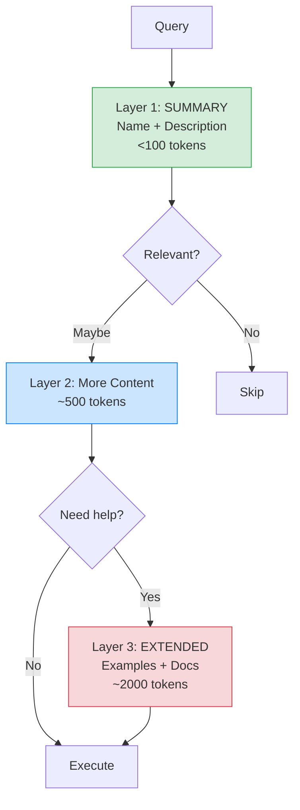

</Transform>

::right::

### How It Works

<div class="text-sm">

| Layer | Content | When | Cost |
|-------|---------|------|------|
| **Summary** | Name, description | Always | <100 token |
| **Details** | Details | On match | ~500 token |
| **Extended** | Examples, docs, edge cases | Complex usage | ~2000 token |

</div>

### Example

```text {*}{fontSize:'0.7rem',lineHeight:'1.2'}
Query: "Fix the login bug"

Layer 1: Scan 55 tools → 8 match
Layer 2: Load more context for 8 → 3 relevant  
Layer 3: Load examples for 1 complex tool

Total: 550 + 400 + 200 = 1,150 tokens
vs. All upfront: 11,000 tokens
```

**Key**: Load tool definitions progressively, not all at once.

<!--
This is a general context optimization pattern, applicable to any tool-using system.

Layer 1 - Summary: Just the name and category. Loaded for ALL tools upfront.
Very lightweight (~10 tokens per tool). Used for initial filtering.

Layer 2 - Details: Parameters, return types, use cases, constraints.
Loaded only for tools that MIGHT be relevant based on Layer 1 match.
Medium weight (~50 tokens per tool).

Layer 3 - Full Schema: Complete JSON schema, error handling, edge cases.
Loaded only for tools that WILL be executed. Heavy weight (~200 tokens).

The math is compelling: instead of loading 11,000 tokens for 55 tools,
you load 550 (all summaries) + 400 (8 detail loads) + 600 (3 full schemas) = 1,550 tokens.
That's an 85% reduction in context usage!

This pattern applies to any LLM system with multiple tools - not specific to MCP.
-->

---
layout: center
class: text-center
---

# Part 5: Real-World Implementation

## Windsurf IDE

Rules, Skills, and Agentic Workflows

<!--
Now let's bring it all together with Windsurf, our team's IDE.
This shows how all these concepts - context management, tool use, MCP - come together.
Windsurf is built on these principles and is a great case study for LLM application architecture.
-->

---
layout: two-cols
---

# Windsurf Architecture

### The Three-Layer System

**1. Rules** (`.windsurfrules`)
- Global context and constraints
- Coding standards, preferences
- Project-specific guidelines

**2. Skills**
- Atomic actions (tools)
- `read_file`, `write_file`, `run_test`
- MCP servers under the hood

**3. Workflows**
- Orchestrated sequences
- "Refactor component" = multiple Skills
- Agentic reasoning loop


::right::

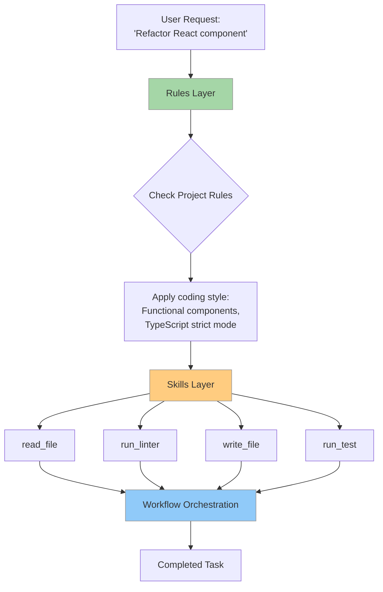


<!--
This is Windsurf's architecture distilled. Three layers that build on each other:
Rules: The "system prompt" that guides all behavior. Think of it as the model's constitution.
Skills: Individual capabilities, often backed by MCP servers. These are the tools we discussed.
Workflows: The agentic orchestration. The model decides which skills to use and in what order.
For example, "refactor this React component" triggers: read file → analyze code → check rules →
generate refactored code → run linter → fix issues → write file → run tests.
The model orchestrates this entire sequence, using rules to make decisions at each step.
-->

---
layout: default
---

# Windsurf: Rules Example

### Project Rules Configuration

Windsurf allows you to configure project-wide rules and preferences through its settings. Example configuration:

```markdown {*}{fontSize:'0.65rem',lineHeight:'1.2'}
# Project-wide coding standards

## Language & Framework
- Language: TypeScript
- Framework: React
- Use functional components with hooks
- Prefer arrow functions
- No default exports
- Always use strict TypeScript mode

## Testing
- Write tests for all business logic
- Use Jest and React Testing Library
- Minimum 80% coverage

## Security
- Never commit API keys or secrets
- Validate all user inputs
- Use parameterized queries for database access
```

**Impact**: These rules are **injected into context** for every LLM request.

The model sees these constraints and follows them automatically!

*Note: Configuration format may vary by Windsurf version - check current documentation for exact syntax.*


<!--
Rules are incredibly powerful. They're essentially a custom system prompt for your project.
When you ask Windsurf to write a component, it already knows: functional, TypeScript, no defaults.
You don't have to repeat "use TypeScript" in every request - it's in the Rules.
This is context engineering at the project level. Rules are typically 500-1000 tokens,
but they save thousands of tokens by preventing back-and-forth clarifications.
Think of Rules as your team's coding standards, encoded for the LLM.
-->

---
layout: default
---

# Windsurf: Skills in Action

### Example Workflow: "Fix the login bug"

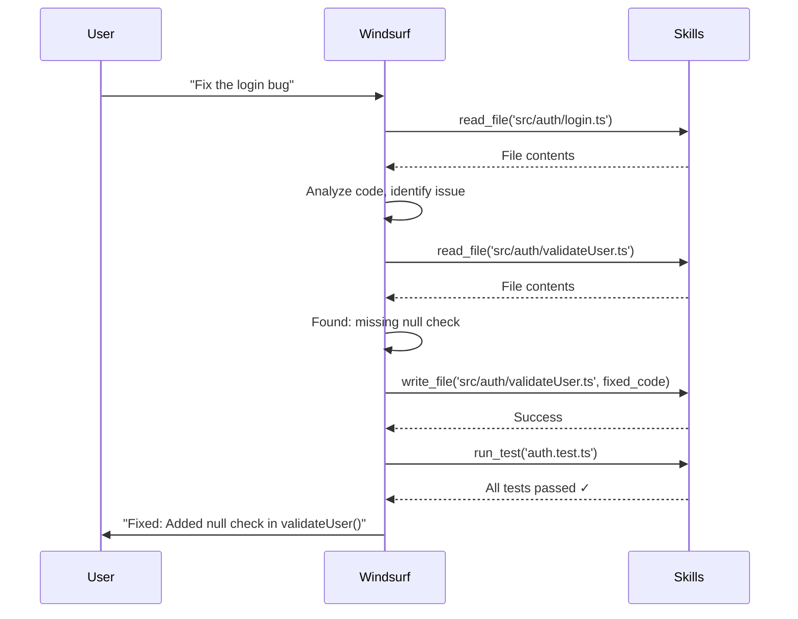

<!--
This shows the agentic loop in action. User gives a high-level request.
Windsurf doesn't just make one change blindly. It:
1. Reads the relevant file
2. Analyzes and forms a hypothesis
3. Reads related files to understand dependencies
4. Makes the fix
5. Runs tests to verify
6. Reports back to the user

Each step is a Skill (tool call). The model decides the sequence based on what it learns.
This is the difference between a simple "code completion" tool and an agent.
The agent can investigate, reason, and verify its own work.
-->

---
layout: default
---

# Windsurf: MCP Integration

### How Windsurf Leverages MCP

**Filesystem MCP Server**
- `read_file`, `write_file`, `list_directory`, `search_code`
- Essential for codebase navigation

**Git MCP Server**
- `git_status`, `git_diff`, `git_commit`
- Enables version control operations

**Language Server MCP** (via Language Server Protocol)
- `get_definitions`, `find_references`, `get_type_info`
- Provides deep code understanding

**Custom Team MCP Servers**
- Internal tooling, APIs, databases
- Team-specific integrations


### Result: Windsurf is **extensible without core changes**

Add a new MCP server → Windsurf gains new capabilities automatically!


<!--
This is where MCP shines in practice. Windsurf doesn't hardcode integrations.
It discovers MCP servers in your configuration and exposes them as Skills.
Want to integrate your company's deployment system? Write an MCP server.
Want to connect to your internal API? Write an MCP server.
Windsurf doesn't need to be modified - it just discovers and uses new servers.
This is the extensibility promise of MCP. It's like a plugin system, but standardized.
The language server integration is particularly powerful - it gives the model semantic code understanding,
not just text manipulation. The model knows types, references, and call hierarchies.
-->

---
layout: default
---

# Windsurf: Context Management Strategy

### How Windsurf Handles Context Limits

**1. Rules are always loaded** (~1,000 tokens)
- Core constraints must always be active

**2. Progressive skill exposure**
- File editing task → load filesystem skills only
- Debugging task → load filesystem + testing skills
- Deployment task → load filesystem + git + CI/CD skills

**3. Dynamic file loading via MCP**
- Don't load entire codebase
- Model requests files as needed: "Show me the auth module"
- MCP fetches only requested files

**4. Conversation summarization**
- After 10-15 exchanges, summarize earlier conversation
- Keep recent context, summarize old context


### Result: Works on large codebases without hitting 200k limit


<!--
This is the production-grade context management strategy in action.
Rules are non-negotiable - they're always in context because they guide all behavior.
Skills are loaded contextually - Windsurf analyzes your request and loads relevant skills.
Files are fetched dynamically - this is MCP's killer feature for code editors.
Conversation summarization is critical for long sessions - you can't let history grow unbounded.
Put these together and you can work on massive codebases with 200k context windows.
Without these strategies, you'd hit limits after analyzing just a few files.
This is the engineering that makes LLM IDEs practical, not just demos.
-->

---
layout: center
class: text-center
---

# Summary

From Tokens to Production

<!--
Let's wrap up and connect everything we've covered.
-->

---
layout: two-cols
---

# Key Takeaways

### 1. Context is Everything

- LLMs are **stateless** - your app manages memory
- Context windows are finite and expensive
- **Quality in = Quality out**

### 2. Context Engineering

- **Select**: RAG, semantic search, recency
- **Compress**: Summarization, sliding windows
- **Distribute**: Multi-agent architectures
- Progressive disclosure saves tokens

::right::

### 3. Tool Use Transforms LLMs

- Models generate **structured JSON intent**
- Your app executes, model reasons
- From chatbots to **agents that act**

### 4. Production Patterns

- Prompt engineering: Role, Few-shot, CoT, Format
- Tool definitions as structured output
- Dynamic loading over upfront dumping
- MCP standardizes tool integration

<!--
Two core themes to remember:

1. Context Management - This is the fundamental constraint.
   - LLMs don't remember anything - YOU replay conversation history
   - The context window fills up fast - select, compress, distribute
   - Put important information at the start or end (lost in middle)
   - Progressive disclosure applies to both tools and documents

2. Tool Use - This is what makes LLMs useful.
   - The model outputs structured JSON (structured output in action)
   - Your code executes the tool, feeds result back
   - This loop is the foundation of all agentic systems
   - MCP standardizes this for ecosystem-wide interoperability

Everything else builds on these two pillars.
-->

---
layout: center
class: text-center
---

# Next Steps

### For Our Team

1. **Explore Windsurf's Rules Configuration**
   Customize project settings and preferences

2. **Build a Simple MCP Server**
   Start with internal tool integration

3. **Experiment with Tool Use**
   Function calling in your applications

4. **Optimize Context Usage**
   Apply progressive disclosure patterns


<div class="pt-8">

### Resources

- [MCP Documentation](https://modelcontextprotocol.io)
- [OpenAI Function Calling Guide](https://platform.openai.com/docs/guides/function-calling)
- [Anthropic Prompt Engineering](https://docs.anthropic.com/claude/docs/prompt-engineering)

</div>


<!--
Concrete next steps for our team.
First, if you're using Windsurf, explore its Rules configuration - customize it for YOUR project.
Second, pick an internal tool and write a simple MCP server. Could be a config reader, a build tool, anything.
Third, add function calling to an existing project - even something simple like web search.
Fourth, profile your context usage and optimize. Are you dumping too much upfront?
The resources listed are authoritative and well-maintained - they're your reference docs.
Most importantly: experiment. LLM engineering is still new. Try things, measure, iterate.
-->

---
layout: center
class: text-center
---

# Q&A

Any questions?

<!--
Open the floor for questions. Common questions to be ready for:
- "How much does MCP cost?" → It's open source, free to implement
- "Can we use MCP with GPT-4?" → Yes, any LLM API with tool use can integrate MCP
- "How do we secure tool execution?" → Sandboxing, permissions, input validation
- "What's the best way to start?" → Pick one tool, write a simple MCP server, test with Claude Desktop
- "Does Windsurf support custom MCP servers?" → Yes, configure in settings

Be ready to demo if time allows. Have Claude Desktop with an MCP server configured,
or show Windsurf's Rules configuration from an actual project.
-->
