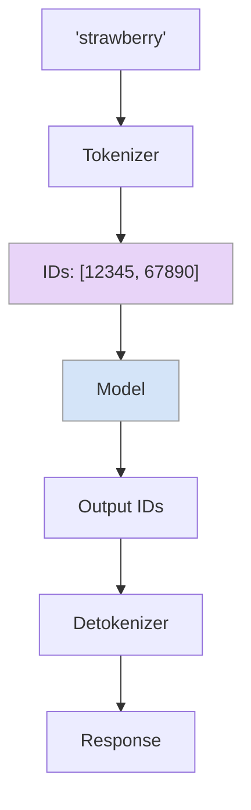
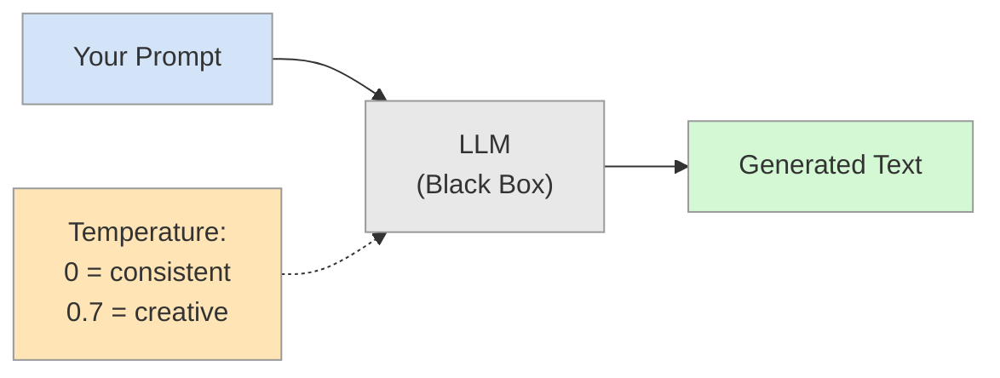
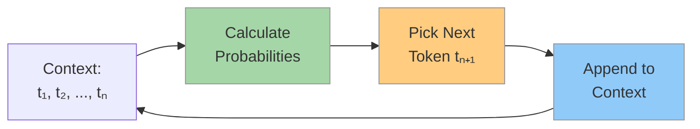
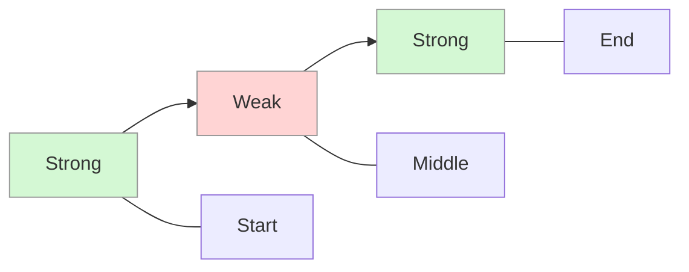
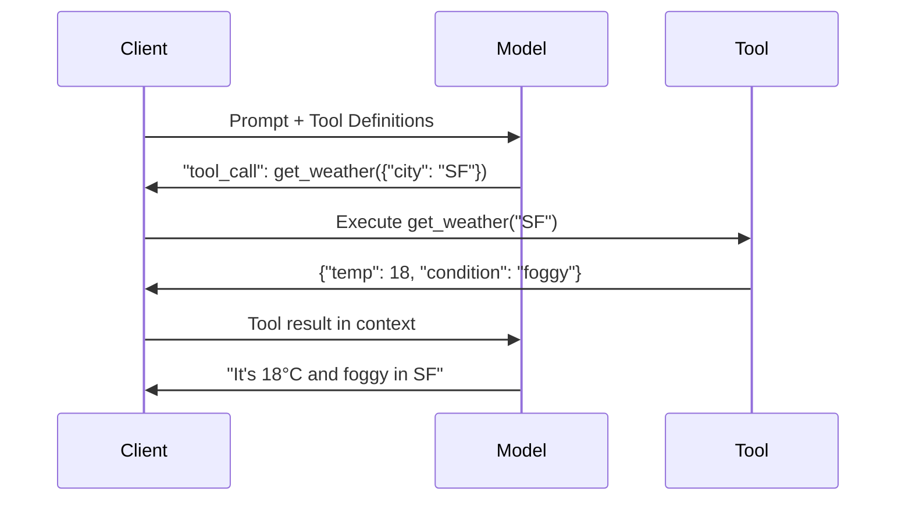
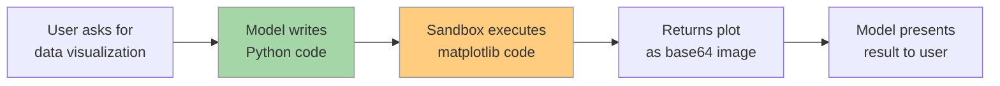
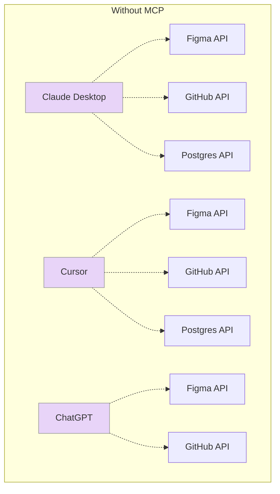
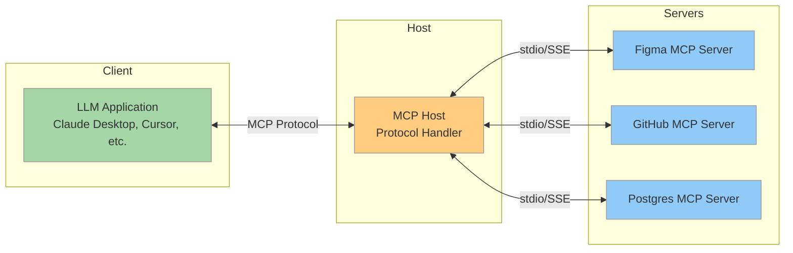
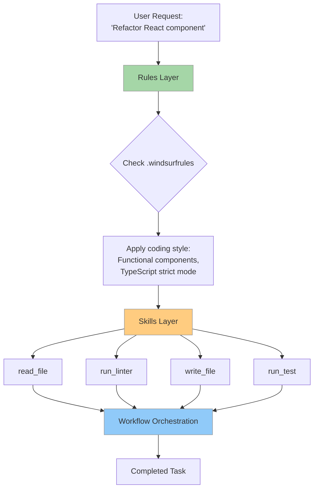
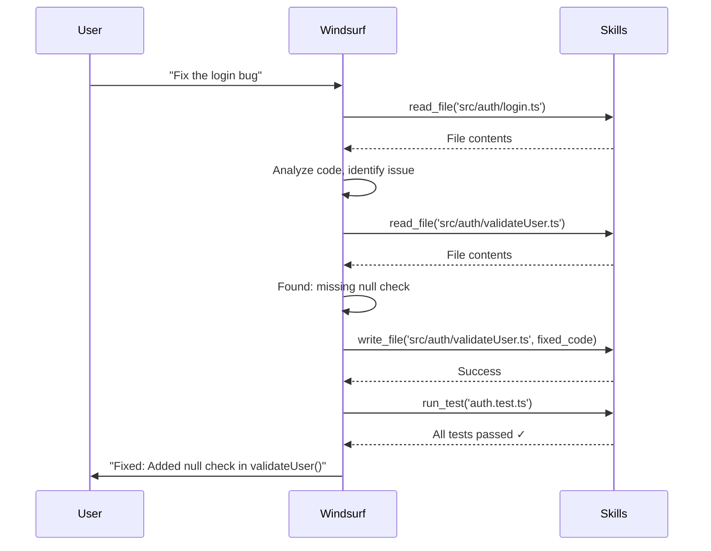

# Beyond the Chatbox

Autoregression, Context, and MCP

<div class="pt-12">
  <span @click="$slidev.nav.next" class="px-2 py-1 rounded cursor-pointer" hover="bg-white bg-opacity-10">
    A Programmer's Guide to the LLM Stack <carbon:arrow-right class="inline"/>
  </span>
</div>

<!--
Welcome everyone. Today we're going deep into how LLMs actually work from a developer's perspective.
This isn't about prompt engineering tricks - it's about understanding the underlying mechanisms.
We'll build up from tokens to the latest MCP protocol that's changing how we integrate tools.
-->

---
layout: default
---

# Agenda

- **The Atom**: Tokens & The "Strawberry" Problem
- **The Resource**: Context Windows & Management
- **The API Evolution**: From Completion to Chat
- **The Hands**: Tool Use (Function Calling & Code Execution)
- **The Protocol**: MCP (Model Context Protocol)
- **The Workflow**: Windsurf's Rules, Skills, and Agent Orchestration

<!--
We'll start from the fundamentals - what tokens are and why they matter.
Then we'll see how context windows work and their limitations.
The middle section covers how we interact with models through APIs and tools.
Finally, we'll explore MCP and see it in action with Windsurf, our team's IDE.
This progression mirrors how you'd actually build an LLM application from scratch.
-->

---
layout: two-cols
---

# Tokens: The "Atom" of LLMs

<v-clicks>

- LLMs don't "see" text as humans do
- **Byte Pair Encoding (BPE)** splits text into subword units
- Each token → unique integer ID
- Model operates purely on token IDs

</v-clicks>

<v-click>

### The "Strawberry" Case Study

```text
"How many 'r's in 'strawberry'?"

Tokenization:
"strawberry" → ["st", "raw", "berry"]
             → [302, 1618, 19772]
```

**The Problem**: The model never "sees" individual letters!

Real example: [OpenAI tokenizer](https://platform.openai.com/tokenizer)

</v-click>

::right::

<v-click>

<Transform :scale="0.7">



</Transform>

</v-click>

<v-click>

### Developer Takeaway

<v-clicks>

- Token boundaries affect string operations
- Impacts JSON parsing, code generation
- Why some prompts need repetition

</v-clicks>

</v-click>

<!--
This is crucial to understand. When GPT-4 couldn't count r's in strawberry, it wasn't being stupid.
The tokenizer had already broken it into chunks, and the model only saw those chunk IDs.
This has real implications: JSON parsing can fail at token boundaries, especially with nested structures.
Code generation sometimes repeats itself because token probabilities favor common patterns.
Understanding tokenization helps debug weird LLM behaviors.
-->

---
layout: two-cols
---

# Autoregression: The Black Box View

<Transform :scale="0.9">


</Transform>

::right::

<v-clicks>

### What You Control

**Focus on:**
- **Input**: Your prompt
- **Output**: Generated text
- **Control**: Temperature

</v-clicks>

<v-click>

### Temperature Impact

- **0**: `"Paris"` (deterministic)
- **0.7**: `"Paris, a beautiful city..."` (balanced)
- **1.5**: `"Paris! Or Rome? Tokyo?"` (creative)

</v-click>

<!--
Start with what developers actually interact with: prompts and temperature.
The black box abstraction helps focus on controllable parameters first.
Give concrete examples of how temperature affects output.
This builds intuition before diving into the mechanism.
-->

---
layout: default
---

# Inside the Black Box: The Completion Loop

### The Autoregressive Mechanism

<v-clicks>

For **each token**, the model:
1. Looks at **all previous tokens**
2. Calculates: $P(t_{next} | t_1, t_2, ..., t_n)$
3. Picks next token
4. Appends to context and repeats

</v-clicks>

<v-click>

<Transform :scale="0.65">



</Transform>

</v-click>

<v-click>

### Key Insights

- Each token depends on **ALL previous tokens**
- Once generated, it **can't be changed**
- Early mistakes **cascade**
- **Context order matters**

</v-click>

<!--
Now reveal the autoregressive mechanism to explain behaviors like:
- Why LLMs can't "change their mind" mid-generation
- Why early mistakes cascade (if it starts saying "Paris is in Germany", it continues with that context)
- Why context order matters (recent tokens have more weight)
Understanding this helps debug unexpected LLM behaviors.
This also explains why techniques like "thinking before answering" work - better early tokens lead to better final output.
-->

---
layout: default
---

# Context Window: The Finite Frontier

### The "Filling Up" Problem

<v-clicks>

200k tokens sounds large, but fills up fast:

```text
System Instructions:     2,000
Chat History:           50,000
RAG Documents:          30,000
Tool Definitions:       10,000
Code Files:             80,000
                       ________
Total:                 172,000 tokens
```

</v-clicks>

<v-click>

### The "Lost in the Middle" Phenomenon

<Transform :scale="0.65">



</Transform>

Models recall best from **start** or **end** of context.

</v-click>

<!--
This is a hard constraint that shapes everything we do with LLMs.
200k sounds huge, but in practice it fills up fast with conversation history and documents.
The "lost in the middle" phenomenon is research-backed: models are attention-based,
and they naturally weight the start and end more heavily.
This means: put critical info at the beginning or end, not buried in the middle.
Strategic context management is more important than having a large window.
-->

---
layout: default
---

# The API Evolution

<v-clicks>

### 1. Completion API (GPT-3 era)

```typescript
POST /v1/completions
{
  "model": "text-davinci-003",
  "prompt": "Once upon a time",
  "max_tokens": 100
}
```

Raw "predict the next word" engine. You craft the entire prompt as a string.

</v-clicks>

<v-click>

### 2. Chat Completion API (GPT-3.5+ era)

```typescript
POST /v1/chat/completions
{
  "model": "gpt-4",
  "messages": [
    {"role": "system", "content": "You are a helpful assistant."},
    {"role": "user", "content": "What is recursion?"},
    {"role": "assistant", "content": "Recursion is when a function calls itself..."}
  ]
}
```

Structured conversation with roles. **Better context management**.

</v-click>

<!--
The shift from Completion to Chat API was huge for developers.
Completion API: you had to manually format everything, including conversation history.
Chat API: the SDK manages the message structure, making multi-turn conversations natural.
This structural change enabled better context engineering and made it easier to build conversational apps.
But fundamentally, it's still autoregression - just with better formatting.
-->

---
layout: two-cols
---

# Context Engineering

<v-clicks>

### Key Techniques

**RAG (Retrieval Augmented Generation)**
- Bring external memory
- Query relevant documents dynamically
- Inject only what's needed

**State Management**
- Conversation summarization
- Sliding windows
- Prompt caching (Anthropic)

**Structured Output**
- JSON mode: `response_format: { type: "json_object" }`
- Schema validation with Zod/Pydantic
- Tool responses as structured data

</v-clicks>

::right::

<v-click>

### Structured Output Example

```typescript
const completion = await openai.chat.completions.create({
  model: "gpt-4",
  response_format: { type: "json_object" },
  messages: [
    {
      role: "system",
      content: `Extract user info as JSON:
      {
        "name": string,
        "email": string,
        "age": number
      }`
    },
    {
      role: "user",
      content: "I'm Alice, 28, alice@example.com"
    }
  ]
});

// Guaranteed valid JSON response
const data = JSON.parse(completion.choices[0].message.content);
```

</v-click>

<!--
Context engineering is where you move from hobbyist to professional LLM developer.
RAG is critical for knowledge-intensive apps - you can't fit Wikipedia in a prompt.
Summarization keeps conversations manageable over long sessions.
Structured output is underrated - JSON mode eliminates parsing errors and makes LLM outputs reliable.
When building production apps, always use structured output for data extraction.
Windsurf uses these patterns extensively, as we'll see later.
-->

---
layout: center
class: text-center
---

# Part 3: Extending Capability

## Tool Use (Function Calling)

Giving the Model "Hands"

<!--
Now we get to the exciting part: making LLMs do things, not just say things.
Tool use is what transforms a chatbot into an agent that can search the web, run code, or query databases.
This is foundational for Windsurf and any serious LLM application.
-->

---
layout: two-cols
---

# Tool Use: The Mechanism

<v-clicks>

### How It Actually Works

1. You define tools (functions) in the API call
2. Model generates **structured JSON intent**
3. Your client executes the tool
4. Result feeds back into model's context
5. Model continues reasoning

**Critical**: The model doesn't execute code - it only produces instructions!

</v-clicks>

::right::

<v-click>



</v-click>

<!--
This loop is the heart of agentic systems. The model is the brain, tools are the hands.
The model can't actually DO anything - it just decides WHAT to do.
Your application is responsible for safe execution, error handling, and security.
This separation is actually a feature: you control what the model can access.
The loop continues until the model decides it has enough information to answer.
-->

---
layout: default
---

# Tool Use: Code Example

### Defining Tools

```typescript
const tools = [
  {
    type: "function",
    function: {
      name: "web_search",
      description: "Search the web for current information",
      parameters: {
        type: "object",
        properties: {
          query: { type: "string", description: "Search query" }
        },
        required: ["query"]
      }
    }
  },
  {
    type: "function",
    function: {
      name: "execute_python",
      description: "Execute Python code in a sandboxed environment",
      parameters: {
        type: "object",
        properties: {
          code: { type: "string", description: "Python code to execute" }
        },
        required: ["code"]
      }
    }
  }
];
```

<!--
Tool definitions follow JSON Schema format. Be specific in descriptions - the model uses them to decide when to call.
Notice we have two very different tools: one for external data, one for computation.
The model will choose based on the user's query. "What's the weather?" triggers web_search.
"Calculate 123456 * 789" might trigger execute_python if the model knows it struggles with large multiplication.
-->

---
layout: default
---

# Tool Use: Execution Loop

```typescript {all|1-5|7-11|13-18|20-28|all}
const messages = [
  { role: "system", content: "You are a helpful assistant with access to web search and code execution." },
  { role: "user", content: "What's the current price of Bitcoin? Then calculate 10% of that." }
];

let response = await openai.chat.completions.create({
  model: "gpt-4",
  messages,
  tools
});

// Model decides to call web_search
if (response.choices[0].message.tool_calls) {
  const toolCall = response.choices[0].message.tool_calls[0];
  console.log(`Calling: ${toolCall.function.name}(${toolCall.function.arguments})`);
  // >>> Calling: web_search({"query": "current Bitcoin price"})
}

// Execute the tool
const searchResult = await executeWebSearch(JSON.parse(toolCall.function.arguments).query);
// Result: "Bitcoin is currently trading at $43,250"

// Feed result back to model
messages.push(response.choices[0].message);
messages.push({
  role: "tool",
  tool_call_id: toolCall.id,
  content: JSON.stringify(searchResult)
});
```

<!--
This is the actual implementation pattern. Line by line:
1-5: We start with a user request that requires external data AND computation
7-11: First API call with tool definitions
13-18: Model returns a tool_call JSON, not a text response
20-28: We execute the tool and append the result to the conversation
Then you'd make another API call, and the model might call execute_python next.
This multi-turn loop is how complex tasks get accomplished. Windsurf does this internally.
-->

---
layout: default
---

# Tool Use: Code Execution Example

### Why Code Execution?

<v-clicks>

- LLMs are **bad at math**: `123456 * 789012 = ?` → unreliable
- LLMs can't generate **real-time visualizations**
- But LLMs are **great at writing code** to solve these problems!

</v-clicks>

<v-click>

### The Pattern



</v-click>

<!--
This is a killer feature that makes LLMs actually useful for technical tasks.
Without code execution, asking "plot a sine wave" would just get you a text description.
WITH code execution, the model writes matplotlib code, runs it, and shows you the actual plot.
The same applies to complex math: the model knows to delegate to Python for precision.
This is how tools like Claude Artifacts and ChatGPT Code Interpreter work.
-->

---
layout: default
---

# Code Generation Tool Example

```python {all|1-8|10-18|20-25|all}
# Model generates this code
code = """
import matplotlib.pyplot as plt
import numpy as np

x = np.linspace(0, 2*np.pi, 100)
plt.plot(x, np.sin(x))
plt.savefig('sine_wave.png')
"""

# Your app executes in a sandbox
import subprocess
import base64

result = subprocess.run(
    ["python", "-c", code],
    capture_output=True, timeout=5
)

# Return the image to model
with open('sine_wave.png', 'rb') as f:
    img_base64 = base64.b64encode(f.read()).decode()

tool_result = {
    "status": "success",
    "output": "Plot saved",
    "image": img_base64
}
```

<!--
This shows the complete flow. The model writes syntactically correct Python.
Your application runs it in a sandboxed environment (critical for security).
The result - in this case an image - goes back to the model's context.
The model can then say "Here's your sine wave plot" and the user sees the actual image.
This pattern extends to data analysis, file manipulation, API calls - anything code can do.
Security note: ALWAYS sandbox execution. Use Docker, restricted environments, or services like E2B.
-->

---
layout: center
class: text-center
---

# Part 4: The Protocol Era

## MCP (Model Context Protocol)

The "USB-C" for AI

<!--
Now we get to the cutting edge. MCP is Anthropic's answer to a huge problem in the LLM ecosystem.
Every tool, every integration has been a custom implementation. MCP standardizes this.
Think of it as REST APIs for LLM tool integration.
-->

---
layout: two-cols
---

# MCP: The Problem

<v-clicks>

### Before MCP

Every integration is custom:
- **Figma** → custom API wrapper
- **GitHub** → custom API wrapper
- **Postgres** → custom API wrapper

And this is **per client** (Claude Desktop, Cursor, ChatGPT, etc.)

### The Integration Explosion

```text
N Tools × M Clients = N×M integrations

10 tools × 5 clients = 50 custom integrations!
```

</v-clicks>

::right::

<v-click>



Every arrow is custom code!

</v-click>

<!--
This is the pain point MCP solves. Before MCP, if you built a Figma integration for Claude,
that code wouldn't work for Cursor or any other LLM client.
Tool builders had to write separate implementations for each LLM platform.
Client builders had to write custom integrations for each tool they wanted to support.
This doesn't scale. It's like having different USB connectors for every device.
MCP provides the standard so everyone speaks the same language.
-->

---
layout: default
---

# MCP: The Solution

### Architecture



<v-clicks>

- **Client**: The LLM application (Claude, Cursor, Windsurf)
- **Host**: Manages connections and protocol translation
- **Server**: Provides tools/resources/prompts via standard MCP interface

</v-clicks>

<!--
This is the architecture that makes everything work. Three layers:
1. Client: Your LLM app - it just speaks MCP, doesn't care about underlying tools
2. Host: The middleware that manages connections - often built into the client
3. Servers: Individual tools that implement the MCP spec
Communication happens over stdio or Server-Sent Events - both simple, well-understood protocols.
Once a tool implements MCP, ANY client can use it. Once a client implements MCP, it can use ANY tool.
This is the network effect that will accelerate LLM tool development.
-->

---
layout: default
---

# MCP: Real-World Examples

<v-clicks>

### Filesystem MCP Server

```json
{
  "name": "read_file",
  "description": "Read contents of a file",
  "inputSchema": {
    "type": "object",
    "properties": {
      "path": { "type": "string" }
    },
    "required": ["path"]
  }
}
```

**Use case**: LLM can read project files to understand codebase structure.

</v-clicks>

<v-click>

### Database MCP Server

```json
{
  "name": "query_database",
  "description": "Execute a SQL query",
  "inputSchema": {
    "type": "object",
    "properties": {
      "query": { "type": "string" },
      "database": { "type": "string" }
    },
    "required": ["query"]
  }
}
```

**Use case**: Natural language → SQL query → results back to LLM.

</v-click>

<!--
These are practical, everyday tools you'd actually use.
Filesystem MCP: Instead of copy-pasting files into prompts, the model can read them on-demand.
This is crucial for large codebases where you can't fit everything in context.
Database MCP: Ask "What are our top 10 customers?" and the LLM writes SQL, executes it, and presents results.
The key advantage: these servers are reusable across any MCP-compatible client.
Windsurf, Claude Desktop, and Cursor can all use the same filesystem MCP server.
-->

---
layout: default
---

# MCP: Context Management Benefits

<v-clicks>

### The Old Way: Context Explosion

```typescript
// Dump everything into the prompt
const context = `
File 1: ${readFile('src/app.ts')}      // 500 tokens
File 2: ${readFile('src/db.ts')}       // 800 tokens
File 3: ${readFile('src/api.ts')}      // 600 tokens
... (50 more files)
`;
// Total: 40,000 tokens wasted!
```

### The MCP Way: Dynamic Fetching

```typescript
// Model decides what it needs
Model: "I need to see the database schema"
→ MCP calls read_file('src/schema.sql')  // 200 tokens
→ Model gets exactly what it asked for

// Later in the conversation:
Model: "Now show me the API endpoints"
→ MCP calls read_file('src/api.ts')      // 600 tokens
```

**Result**: Only fetch what's needed, when it's needed.

</v-clicks>

<!--
This is THE killer feature of MCP that people miss. It's not just about standardization.
MCP enables progressive context loading. Instead of shoving your entire codebase into the initial prompt,
the model can request files on-demand as it reasons through the problem.
This is how Windsurf handles large projects without hitting context limits.
The model says "I need to see the user authentication code" and MCP fetches just that file.
This is fundamentally more efficient than traditional RAG, which retrieves everything upfront.
-->

---
layout: default
---

# MCP: The Context Tax

<v-clicks>

### But MCP Has Overhead Too

Every MCP server must be **described** to the model:

```json
{
  "servers": {
    "filesystem": {
      "tools": [
        { "name": "read_file", "description": "...", "schema": {...} },
        { "name": "write_file", "description": "...", "schema": {...} },
        { "name": "list_directory", "description": "...", "schema": {...} }
      ]
    },
    "database": {
      "tools": [
        { "name": "query", "description": "...", "schema": {...} },
        { "name": "list_tables", "description": "...", "schema": {...} }
      ]
    }
  }
}
```

**Cost**: ~100-200 tokens per tool definition
With 20 tools → **2,000-4,000 tokens** just for tool definitions!

</v-clicks>

<!--
This is the tradeoff. MCP solves dynamic fetching but introduces its own context overhead.
Every tool you connect must be described with name, description, and JSON schema.
This adds up fast. If you have 50 tools available, that's 5,000+ tokens before the user even asks a question.
This is why progressive disclosure of skills matters (which we'll see in Windsurf).
Don't tell the model about every tool upfront - only expose tools relevant to the current task.
MCP itself doesn't solve this; it's an application-level optimization you must implement.
-->

---
layout: default
---

# MCP: Progressive Skill Disclosure

<v-clicks>

### The Problem

```typescript
// Bad: Give model ALL tools upfront
const allTools = [
  filesystem_tools,    // 10 tools
  database_tools,      // 8 tools
  api_tools,          // 15 tools
  git_tools,          // 12 tools
  docker_tools        // 10 tools
];
// Total: 55 tools = ~5,500 tokens wasted
```

### The Solution: Contextual Tool Loading

```typescript
// Good: Expose tools based on user intent
const userQuery = "Fix the login bug";

const relevantTools = detectIntent(userQuery);
// Detected: code editing task
// Load only: filesystem_tools + git_tools = ~2,000 tokens

// If user later asks "deploy to production":
// Then dynamically load: docker_tools
```

</v-clicks>

<!--
This is an advanced pattern but critical for production systems.
Analyze the user's request to determine which categories of tools are relevant.
Code debugging? Load filesystem and git tools. Database question? Load DB tools only.
This keeps your context lean and focused. As the conversation evolves, you can load more tools.
Windsurf implements this through its Rules → Skills → Workflow hierarchy.
The Rules help determine which Skills to expose based on the task context.
This is the difference between a demo and a production-grade LLM application.
-->

---
layout: center
class: text-center
---

# Part 5: Real-World Implementation

## Windsurf IDE

Rules, Skills, and Agentic Workflows

<!--
Now let's bring it all together with Windsurf, our team's IDE.
This shows how all these concepts - context management, tool use, MCP - come together.
Windsurf is built on these principles and is a great case study for LLM application architecture.
-->

---
layout: two-cols
---

# Windsurf Architecture

### The Three-Layer System

<v-clicks>

**1. Rules** (`.windsurfrules`)
- Global context and constraints
- Coding standards, preferences
- Project-specific guidelines

**2. Skills**
- Atomic actions (tools)
- `read_file`, `write_file`, `run_test`
- MCP servers under the hood

**3. Workflows**
- Orchestrated sequences
- "Refactor component" = multiple Skills
- Agentic reasoning loop

</v-clicks>

::right::

<v-click>



</v-click>

<!--
This is Windsurf's architecture distilled. Three layers that build on each other:
Rules: The "system prompt" that guides all behavior. Think of it as the model's constitution.
Skills: Individual capabilities, often backed by MCP servers. These are the tools we discussed.
Workflows: The agentic orchestration. The model decides which skills to use and in what order.
For example, "refactor this React component" triggers: read file → analyze code → check rules →
generate refactored code → run linter → fix issues → write file → run tests.
The model orchestrates this entire sequence, using rules to make decisions at each step.
-->

---
layout: default
---

# Windsurf: Rules Example

### `.windsurfrules` file

```yaml
# Project-wide coding standards
language: TypeScript
framework: React
style:
  - Use functional components with hooks
  - Prefer arrow functions
  - No default exports
  - Always use strict TypeScript mode

testing:
  - Write tests for all business logic
  - Use Jest and React Testing Library
  - Minimum 80% coverage

security:
  - Never commit API keys or secrets
  - Validate all user inputs
  - Use parameterized queries for database access
```

<v-clicks>

**Impact**: These rules are **injected into context** for every LLM request.

The model sees these constraints and follows them automatically!

</v-clicks>

<!--
Rules are incredibly powerful. They're essentially a custom system prompt for your project.
When you ask Windsurf to write a component, it already knows: functional, TypeScript, no defaults.
You don't have to repeat "use TypeScript" in every request - it's in the Rules.
This is context engineering at the project level. Rules are typically 500-1000 tokens,
but they save thousands of tokens by preventing back-and-forth clarifications.
Think of Rules as your team's coding standards, encoded for the LLM.
-->

---
layout: default
---

# Windsurf: Skills in Action

### Example Workflow: "Fix the login bug"



<!--
This shows the agentic loop in action. User gives a high-level request.
Windsurf doesn't just make one change blindly. It:
1. Reads the relevant file
2. Analyzes and forms a hypothesis
3. Reads related files to understand dependencies
4. Makes the fix
5. Runs tests to verify
6. Reports back to the user

Each step is a Skill (tool call). The model decides the sequence based on what it learns.
This is the difference between a simple "code completion" tool and an agent.
The agent can investigate, reason, and verify its own work.
-->

---
layout: default
---

# Windsurf: MCP Integration

<v-clicks>

### How Windsurf Leverages MCP

**Filesystem MCP Server**
- `read_file`, `write_file`, `list_directory`, `search_code`
- Essential for codebase navigation

**Git MCP Server**
- `git_status`, `git_diff`, `git_commit`
- Enables version control operations

**Language Server MCP** (via Language Server Protocol)
- `get_definitions`, `find_references`, `get_type_info`
- Provides deep code understanding

**Custom Team MCP Servers**
- Internal tooling, APIs, databases
- Team-specific integrations

</v-clicks>

<v-click>

### Result: Windsurf is **extensible without core changes**

Add a new MCP server → Windsurf gains new capabilities automatically!

</v-click>

<!--
This is where MCP shines in practice. Windsurf doesn't hardcode integrations.
It discovers MCP servers in your configuration and exposes them as Skills.
Want to integrate your company's deployment system? Write an MCP server.
Want to connect to your internal API? Write an MCP server.
Windsurf doesn't need to be modified - it just discovers and uses new servers.
This is the extensibility promise of MCP. It's like a plugin system, but standardized.
The language server integration is particularly powerful - it gives the model semantic code understanding,
not just text manipulation. The model knows types, references, and call hierarchies.
-->

---
layout: default
---

# Windsurf: Context Management Strategy

<v-clicks>

### How Windsurf Handles Context Limits

**1. Rules are always loaded** (~1,000 tokens)
- Core constraints must always be active

**2. Progressive skill exposure**
- File editing task → load filesystem skills only
- Debugging task → load filesystem + testing skills
- Deployment task → load filesystem + git + CI/CD skills

**3. Dynamic file loading via MCP**
- Don't load entire codebase
- Model requests files as needed: "Show me the auth module"
- MCP fetches only requested files

**4. Conversation summarization**
- After 10-15 exchanges, summarize earlier conversation
- Keep recent context, summarize old context

</v-clicks>

<v-click>

### Result: Works on large codebases without hitting 200k limit

</v-click>

<!--
This is the production-grade context management strategy in action.
Rules are non-negotiable - they're always in context because they guide all behavior.
Skills are loaded contextually - Windsurf analyzes your request and loads relevant skills.
Files are fetched dynamically - this is MCP's killer feature for code editors.
Conversation summarization is critical for long sessions - you can't let history grow unbounded.
Put these together and you can work on massive codebases with 200k context windows.
Without these strategies, you'd hit limits after analyzing just a few files.
This is the engineering that makes LLM IDEs practical, not just demos.
-->

---
layout: center
class: text-center
---

# Summary

From Tokens to Production

<!--
Let's wrap up and connect everything we've covered.
-->

---
layout: two-cols
---

# Key Takeaways

<v-clicks>

### 1. Foundation Matters
- Tokens → Autoregression → Context
- Understanding these shapes everything

### 2. API Evolution
- Completion → Chat → Tool Use
- From "prompting" to "protocol engineering"

### 3. Tool Use is Critical
- Function calling + code execution
- LLMs become agents, not just chatbots

### 4. MCP is the Future
- Standardized tool integration
- Dynamic context fetching
- Extensibility without rewrites

</v-clicks>

::right::

<v-click>

### 5. Production Patterns

<v-clicks>

**Context Engineering**
- Structured output (JSON mode)
- Progressive skill disclosure
- Dynamic fetching over upfront loading

**Real-World Architecture**
- Rules for global constraints
- Skills for atomic actions
- Workflows for orchestration

**Windsurf as Case Study**
- Combines all these patterns
- MCP for extensibility
- Context management for scale

</v-clicks>

</v-click>

<!--
These are the key mental models to take away.
Foundation: You can't debug LLM apps without understanding tokens and context.
API Evolution: We've moved from prompt hacking to engineering structured interactions.
Tool Use: This is what makes LLMs useful beyond conversation - they can DO things.
MCP: This will standardize the ecosystem and accelerate development.
Production Patterns: Context management, progressive disclosure, structured output - these separate toys from tools.
Windsurf embodies these principles: Rules + Skills + Workflows on top of MCP.
When you build your next LLM feature, think in terms of these layers.
-->

---
layout: center
class: text-center
---

# Next Steps

<v-clicks>

### For Our Team

1. **Explore Windsurf's `.windsurfrules`**
   Customize for your projects

2. **Build a Simple MCP Server**
   Start with internal tool integration

3. **Experiment with Tool Use**
   Function calling in your applications

4. **Optimize Context Usage**
   Apply progressive disclosure patterns

</v-clicks>

<v-click>

<div class="pt-8">

### Resources

- [MCP Documentation](https://modelcontextprotocol.io)
- [OpenAI Function Calling Guide](https://platform.openai.com/docs/guides/function-calling)
- [Anthropic Prompt Engineering](https://docs.anthropic.com/claude/docs/prompt-engineering)

</div>

</v-click>

<!--
Concrete next steps for our team.
First, if you're using Windsurf, dig into .windsurfrules - make it work for YOUR project.
Second, pick an internal tool and write a simple MCP server. Could be a config reader, a build tool, anything.
Third, add function calling to an existing project - even something simple like web search.
Fourth, profile your context usage and optimize. Are you dumping too much upfront?
The resources listed are authoritative and well-maintained - they're your reference docs.
Most importantly: experiment. LLM engineering is still new. Try things, measure, iterate.
-->

---
layout: center
class: text-center
---

# Q&A

Any questions?

<!--
Open the floor for questions. Common questions to be ready for:
- "How much does MCP cost?" → It's open source, free to implement
- "Can we use MCP with GPT-4?" → Yes, any LLM API with tool use can integrate MCP
- "How do we secure tool execution?" → Sandboxing, permissions, input validation
- "What's the best way to start?" → Pick one tool, write a simple MCP server, test with Claude Desktop
- "Does Windsurf support custom MCP servers?" → Yes, configure in settings

Be ready to demo if time allows. Have Claude Desktop with an MCP server configured,
or show the Windsurf .windsurfrules file from an actual project.
-->
